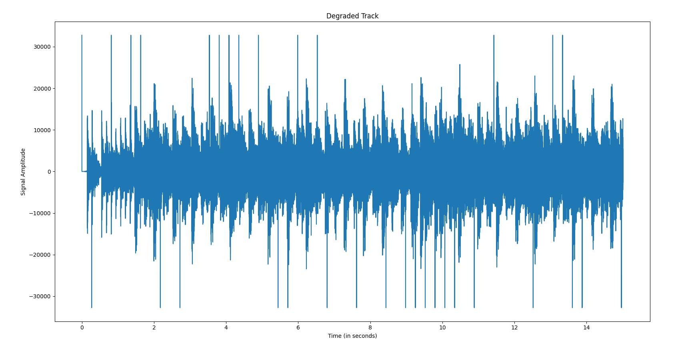
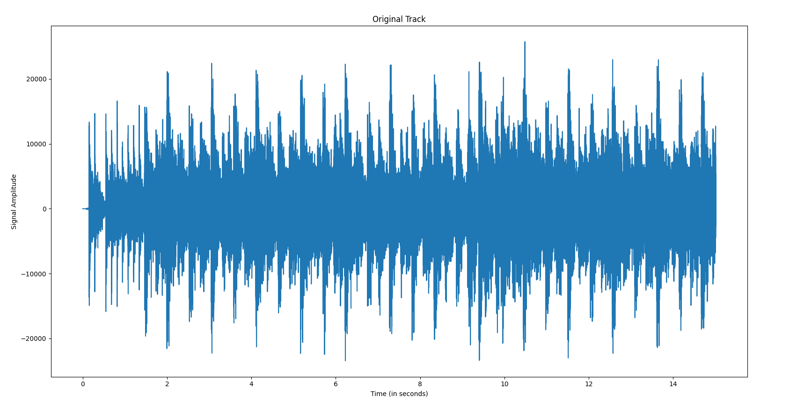
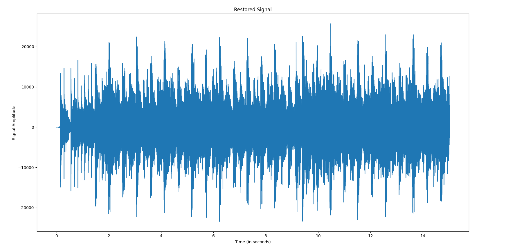
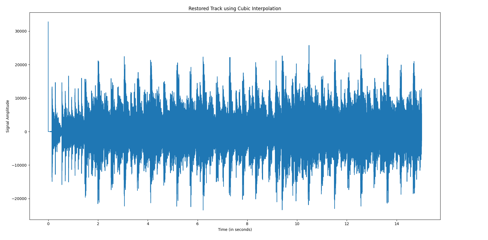
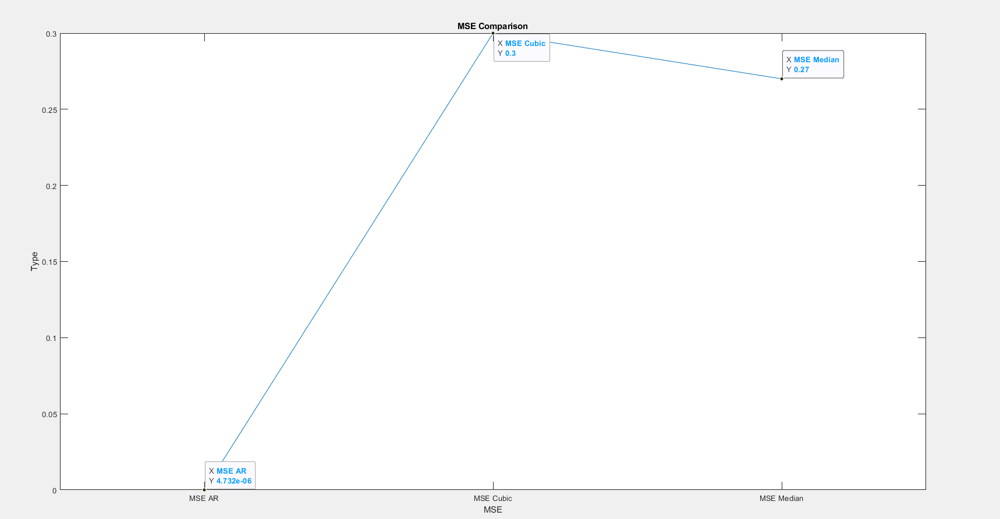
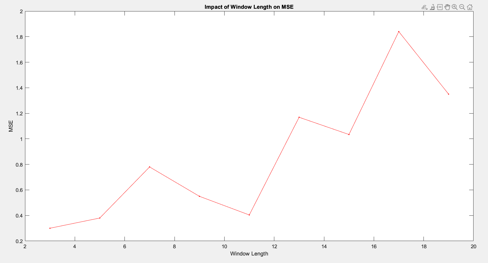
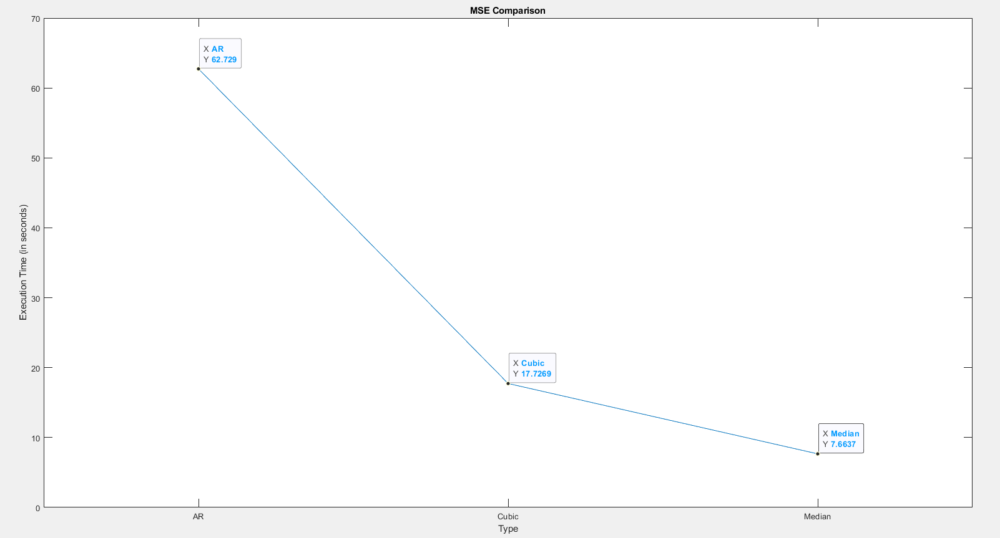
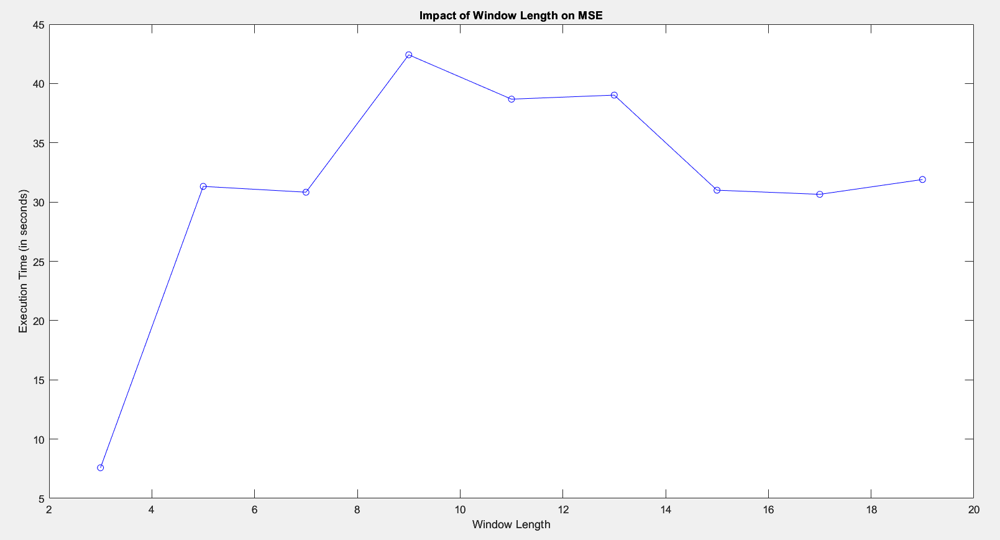

# Audio Restoration Project

## Brief Overview

Audio restoration has become an integral part of digit age and it's tasks range from restoring old recordings to reducing noise in modern audio tracks. An important task of audio restoration algorithms is to remove random clicks in an audio signal which can be done using several methods, namely, AR Method, Cubic Interpolation and Median Filtering. The current project demonstrates two kinds of "click" removal mechanisms:
1. Median Filtering
2. Cubic Interpolation

The current project uses an original audio track which is then degraded by adding high amplitudes at random points. The file
`new_clean.wav`
is an original audio track which does not have any degradations or "clicks". Henceforth, the term "clicks" will be used to denote degradations in the tracks. 
The file `new_degraded.wav` is the degraded track in which distinct clicks can be heard at random points. `cubic_clean.wav` is the audio track that was restored using cubic interpolation. `clean_median.wav` is the audio track that was restored using median filtering.

## Getting started
The project is divided into 3 main files:
1. Median_Flter_Restoration.py
2. Cubic_Audio_Restoration.py
3. unit_test.py

### Dependencies

To run any of the files, please check whether your machine has the following dependencies:
1. wave
2. tqdm
3. matplotlib
4. pandas
5. scipy
6. playsound
7. pymatreader
8. alive_progress
9. sys
10. subprocess

The following dependencies can be installed on a local machine using the following command - `pip install <dependency_name>`
A list of dependencies is available in the file `requirements.txt`

### Cloning the Project
The project can be cloned to a local machine via a terminal window using the command:
```sh
git clone https://github.com/radiobenzene/Audio_Restoration.git
```

## Median Filtering
Let us detail the algorithm for median filtering:
1. Read input track - `new_degraded.wav`
2. Read .mat file (Matlab) `threshold_bk.mat` that contains a list of points where clicks exist. For convenience, we shall denote them as "indicators".
3. Convert the .mat file to an array. As a Matlab file is read as a "Dictionary" type, we must convert it into an "Array"
4. Get the indices of those points where the .mat file has clicks, i.e. the indicator gets a value of 1
5. Set a window length for the median filtering
6. Define a certain constant length, i.e. delta, which is an offset of window length. This value will help us apply the median filtering only around the specified window
7. Apply the median filter, i.e Sorting the points which lie within the window range and calculating the median value.
8. Substitue those values which have been filtered back into the track
9. Write the track to a new file - `clean_median.wav`

## Cubic Interpolation
Let us detail the algorithm for cubic interpolation:
1. Read input track - `new_degraded.wav`
2. Read .mat file (Matlab) `threshold_bk.mat` that contains a list of points where clicks exist. For convenience, we shall denote them as "indicators".
3. Convert the .mat file to an array. As a Matlab file is read as a "Dictionary" type, we must convert it into an "Array"
4. Get the indices of those points where the .mat file has clicks, i.e. the indicator gets a value of 1
5. Get the track length and convert the track length into a range, starting from [0,len(track)]
6. From the degraded track, first remove the indices where a click has been detected, then remove the data points corresponding to these indices.
7. Apply the out-of-the-box function `CubicSpline()` which will interpolate those points.
8. Substitue those values which have been filtered back into the track
9. Write the track to a new file - `clean_cubic.wav`

## Implementation specifics
The following command must be typed in to run the median filtering algorithm on a local machine:
```
python3 Median_Flter_Restoration.py --run
```
or
```
python3 Median_Flter_Restoration.py -r
```
The following command must be typed in to run the cubic interpolation algorithm on a local machine:
```
python3 Cubic_Interpolation_Algorithm.py --run
```
or
```
python3 Cubic_Interpolation_Algorithm.py -r
```
The command extensions for the project are as follows:
```
python3 Median_Flter_Restoration.py --run
python3 Median_Flter_Restoration.py --mse
python3 Median_Flter_Restoration.py --plot
python3 Median_Flter_Restoration.py --diff
python3 Median_Flter_Restoration.py --theme
python3 Median_Flter_Restoration.py --sound
python3 Median_Flter_Restoration.py --unit
python3 Median_Flter_Restoration.py --help
```
A list of features can be found by typing:
```
python3 Median_Flter_Restoration.py --help
```
The user may also type the initial letter of each command extension, i.e `-h`, `-m`, `-p`, `-d`, `-t`, `-s`, `-u` and `-h` respectively.
The command extension `--run` runs the project, creating a restored audio file and displaying the execution time. 
For the cubic interpolation algorithm, replace `Median_Flter_Restoration` with `Cubic_Interpolation_Algorithm`. The two programs share command extensions. 

## Plots
### Plots for the Median Filtered Audiotrack
These are the plots
The plots can be printed using the following command
```
python3 Median_Flter_Restoration.py --plot
```
### Plots for the Cubic Interpolated Audiotrack
These are the plots
The plots can be printed using the following command
```
python3 Cubic_Audio_Restoration --plot
```

#### The Plot for a degraded audiotrack 


#### Plot for the original clean audiotrack


#### Plot for a restored audiotrack using median filtering


#### Plot for a restored audiotrack using cubic interpolation


## Unit testing
To run unit tests for the `medianFilter()` function, type in the command 
```
python3 Median_Flter_Restoration.py --unit
```
This generates 5 tests on different tests sets with a minimum list length of *10* and a maximum of *20052*.
The user may also run 2 separate unit tests by executing the file `unit_test.py` using the following command
```
python3 unit_test.py
```
After every unit test, an **OK** is printed if the test is passed, otherwise **NOT OK** is printed, along with the number of passed and failed tests.
The unit test feature is only available for median filtering.
The separate file `unit_test.py` uses Python's *unittest* module and runs only 2 tests.

## Performance Metrics
The Mean Sqaured Error, or the MSE, was calculated for the restored track and the original track to quantify the improvement on the audiotrack. The following command can be used to print the MSE:
```
python3 Median_Flter_Restoration.py --mse
```
To get the MSE of the cubic interpolated audiotrack, the following command must be used:
```
python3 Cubic_Audio_Restoration --mse
```
### Mean Squared Error
The MSE for the median filtered track is **0.27** and the MSE for the Cubic Interpolated track is **0.30**. The difference between the MSEs of the 2 tracks can be printed using the following command:
```
python3 Median_Flter_Restoration.py --diff
```
The comparison of the MSEs can be visualized on the following graph:


The comparison of the MSEs with respect to a change in window length can be visualized on the following graph:


### Execution Time
The execution time for a track restored using a **median filter** is **7.6637** seconds.
The execution time for a track restored using a **cubic interpolation** is **17.7269** seconds
The execution time for a track restored using an **AR Model** is **62.729** seconds

The comparison of the execution time for a median filter can be visualized on the following graph:


The comparison of the execution time for a median filter with respect to a change in window length can be visualized on the following graph:


## Themes
An interesting addition to the project is the option of changing the theme of the loader which can be done using the extension `--theme` or `-t`. 

## Credits 
Written by Uditangshu. Project for the 5C22 Computational Methods Module. Trinity College Dublin. 2022.
